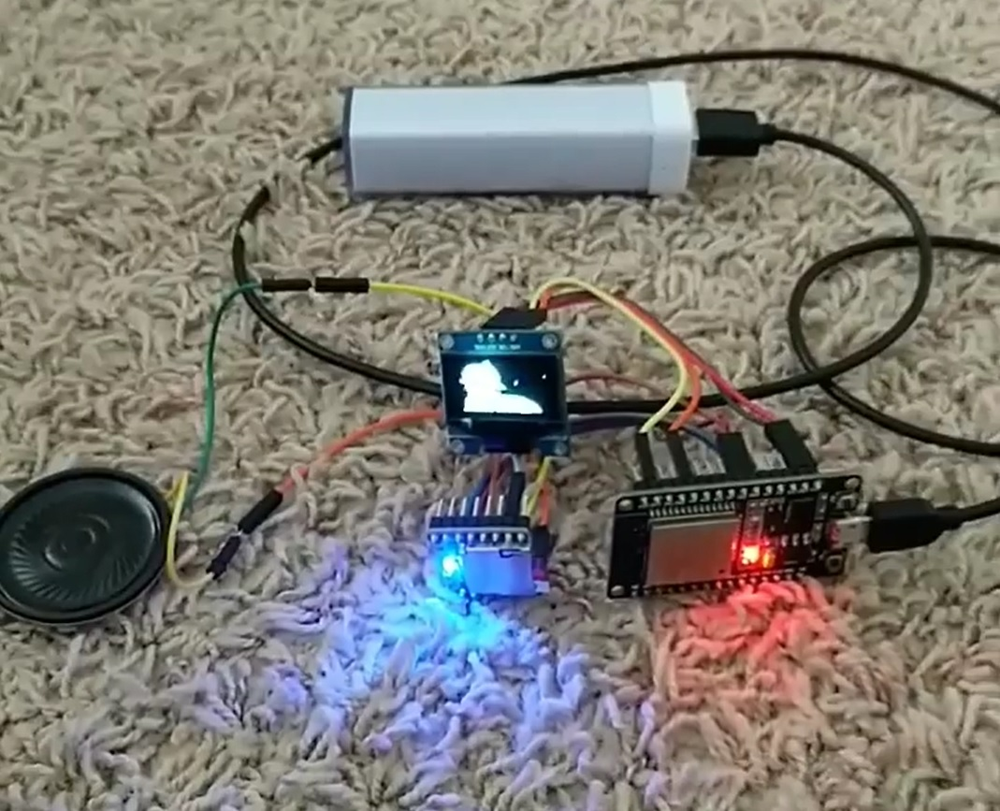

# ESP32_BadApple
This is a fork of hackffm's port of Bad Apple for ESP32. It uses the Heatshrink compression library to decompress the RLE encoded video data. Video and sound are working!

## Hardware Requirements
- ESP32 board
- SH1106 OLED display
- DFPlayer Mini MP3 Module
- SD card
- Speaker (or two if you want)

## Software Requirements
* Arduino 1.8.x
* ESP32 Arduino core
* DFRobotDFPlayerMini library
* Adafruit SH1106 library
* ESP32 SPIFFS Upload Plugin

# Usage
* Adapt display pins in main sketch if necessary
* Use GPIO 16 and 17 of the ESP32 to attach the DFPlayer's UART pin
* Copy the audio file to the root directory of the SD card
* Upload sketch to the ESP32
* Upload sketch data via "Tools" -> "ESP32 Sketch Data Upload"

Enjoy the video with sound :)

# How does it work
Video have been separated into >6500 single pictures, resized to 128x64 pixels using VLC. 
Python script used to run-length encode the 8-bit-packed data using 0x55 and 0xAA as escape marker and putting all into one file.
RLE file has been further compressed using heatshrink compression for easy storage into SPIFFS (which can hold only 1MB by default). 
Heatshrink for Arduino uses ZIP-like algorithm and is available also as a library under https://github.com/p-v-o-s/Arduino-HScompression and 
original documentation is here: https://spin.atomicobject.com/2013/03/14/heatshrink-embedded-data-compression/

# Known issues
None.
